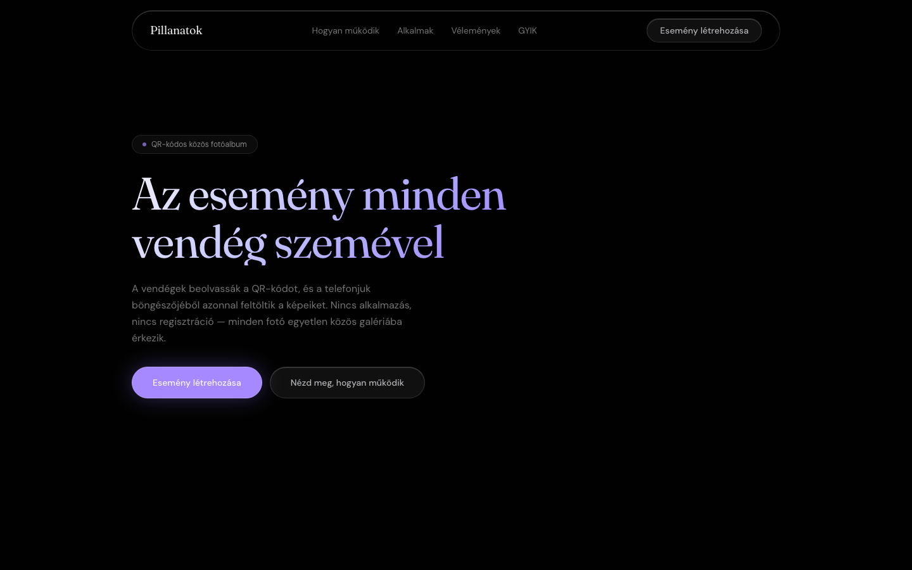

# Fomio

**QR-code-based shared photo album for events.**
Guests scan a QR code and upload photos directly from their phone browser — no app, no account needed. Every photo lands in one shared gallery the host can download afterward.



---

## Tech Stack

- **Next.js** + **Tailwind CSS**
- **TypeScript**
- Glassmorphism design: liquid glass nav, gradient border cards, backdrop-filter blur effects

## Getting Started

```bash
pnpm install
pnpm dev
```

App runs at `http://localhost:3000`.

## Project Structure

```
app/
  layout.tsx              # Root layout, fonts, metadata
  page.tsx                # Landing page — all sections composed here
  globals.css             # Global styles and Tailwind config
components/
  site/                   # Landing page sections
    hero.tsx
    stats.tsx
    how-it-works.tsx
    occasions.tsx
    testimonials.tsx
    qr-preview.tsx
    live-demo.tsx
    photo-quality.tsx
    faq.tsx
    final-cta.tsx
    footer.tsx
  ui/                     # Shared UI primitives
public/
  images/                 # All photography assets
```

## Features

- **No app required** — guests upload directly from their browser
- **Real-time gallery** — photos appear instantly for everyone
- **Private by default** — album accessible only via QR code or link
- **ZIP download** — host downloads all photos in one click
- **Live QR preview** — generated on the fly from the event name
